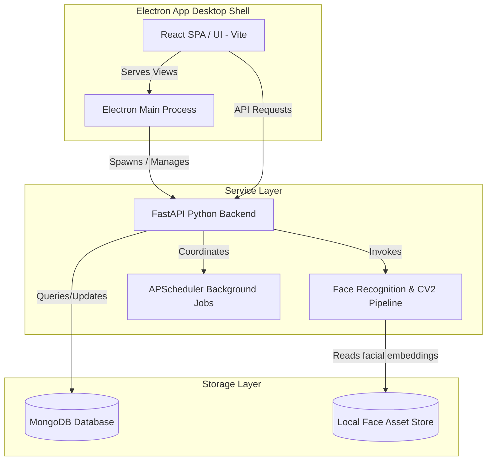

# 🔮 AI Face Recognition Employee Attendance & Monitoring System

[](https://fastapi.tiangolo.com/)
[](https://react.dev/)
[](https://www.electronjs.org/)
[](https://vitejs.dev/)
[](https://www.mongodb.com/)
[](https://www.python.org/)

An advanced, premium-tier hybrid **Desktop & Web** employee attendance tracker powered by artificial intelligence. This system combines a modern, reactive React web application with a high-performance Python FastAPI service to offer state-of-the-art live facial recognition attendance tracking. It runs seamlessly inside a lightweight **Electron** container locally, and is fully configured for multi-service **Vercel** cloud deployments.

---

## 🏗️ System Architecture

The project is architected as three main services:



---

## ✨ Features

- **🧠 Live Face Recognition Pipeline**: Ultra-fast biometric identification using convolutional neural network models (`face-recognition` & `dlib`) and OpenCV camera streaming.
- **⚡ Advanced FastAPI Backend**: Asynchronous endpoints, custom JWT token authentication, modular routers, cache warming for facial embeddings, and background schedulers (`APScheduler`).
- **🎨 Sleek Premium Dashboard**: Beautiful user experience with tailored CSS variables, dark-mode default interface, rich transitions, responsive layouts, data analytics via `Recharts`, and modern icons with `Lucide React`.
- **💻 Desktop Integration**: Built-in native Electron wrapper with cross-platform native notification dispatchers and dynamic lifecycle controllers.
- **🚀 Cloud Deployment Ready**: Integrated `vercel.json` and multi-service configurations for instantaneous cloud deployment of frontend and serverless Python backends.
- **🔋 Offline Autopilot scripts**: Automated startup pipelines checking local databases, warming cache files, and launching all servers with a single command.

---

## 🛠️ Tech Stack

### Frontend Service
- **React (v19)** with **Vite (v8)**
- **Recharts** for attendance telemetry and trends
- **Lucide React** for interactive, premium iconography
- Customized Vanilla CSS3 theme framework supporting HSL-tailored variables

### Backend Sidecar
- **Python (v3.10+)** with **FastAPI**
- **Dlib** & **Face Recognition** (biometrics processing)
- **OpenCV (cv2)** (camera and frame extraction pipelines)
- **APScheduler** (cron tasks, telemetry aggregations, automated report generator)
- **PyJWT** & **bcrypt** (advanced secure user credentials management)
- **PyInstaller** (converts the backend into a zero-dependency local binary executable)

### Desktop Container
- **Electron (v29)** framework
- Subprocess spawning runtime (managing FastAPI instances seamlessly)

### Database
- **MongoDB** (local database or Atlas cloud cluster)

---

## 🚀 Getting Started

### Prerequisites
- **Node.js** (v18 or higher)
- **Python** (v3.10.x - *Note: face-recognition libraries recommend Python 3.10*)
- **MongoDB** (installed locally or a running Atlas instance)

---

### ⚡ Easy Start (Windows Automatic Launcher)

We provide optimized scripts to build and start everything with a single click.

1. **Initialize Database** (First time only):
   Right-click `install_mongodb.bat` and run it as **Administrator** to download/install and configure the MongoDB service automatically.

2. **Launch Application**:
   Double-click `run_desktop.bat` to launch the database, start the FastAPI sidecar, compile the Vite dev server, and boot the Electron client container automatically.

---

### 🔧 Manual Setup

If you prefer to start the services individually, follow the steps below:

#### 1. Setup & Start MongoDB
Start a MongoDB daemon on port `27017` with database path pointing to `./data/mongodb`:
```bash
mongod --dbpath "./data/mongodb" --port 27017
```

#### 2. Configure Backend Service
1. Navigate to the backend folder:
   ```bash
   cd backend
   ```
2. Create a virtual environment and activate it:
   ```bash
   python -m venv venv
   # On Windows:
   .\venv\Scripts\activate
   # On macOS/Linux:
   source venv/bin/activate
   ```
3. Install dependencies:
   ```bash
   pip install -r requirements.txt
   ```
4. Configure environment variables in `./backend/.env` (e.g., `MONGO_URI`, `SECRET_KEY`).
5. Run the FastAPI development server:
   ```bash
   python run.py
   ```

#### 3. Configure Frontend Service
1. Navigate to the frontend folder:
   ```bash
   cd ../frontend
   ```
2. Install npm packages:
   ```bash
   npm install
   ```
3. Boot up the Vite dev server:
   ```bash
   npm run dev
   ```

#### 4. Launch Electron
1. Navigate to the desktop folder:
   ```bash
   cd ../desktop
   ```
2. Install dependencies:
   ```bash
   npm install
   ```
3. Launch the Electron app:
   ```bash
   npm start
   ```

---

## 📦 Bundling & Production Compilation

### Compiling Standalone Backend Executable
The application features a Python builder script to package your backend code into a single, lightning-fast binary executable so it can be deployed on machines without Python installed:

```bash
# Execute standalone compiler
python build_backend.py --execute
```
This produces a compiled binary under `dist/run/` which is read directly by Electron in production.

---

## ☁️ Cloud Deployment (Vercel)

This application is ready out-of-the-box to be deployed as a web application on Vercel. We use Vercel's multi-project `experimentalServices` architecture to configure deployment in one click:

- **Frontend SPA**: Handled by `@vercel/static` mapping to Vite.
- **Backend API**: Deployed as Serverless Python Functions via `@vercel/python` routing directly to our FastAPI endpoints.

Deploy simply by linking the root directory of this repository to Vercel:
```bash
vercel
```

---

## 📝 License
This project is licensed under the ISC License - see the [desktop/package.json](file:///d:/Project/Attendence__Tracking_system/desktop/package.json) file for details.

Developed with 💜 by the **Antigravity Dev Team**.