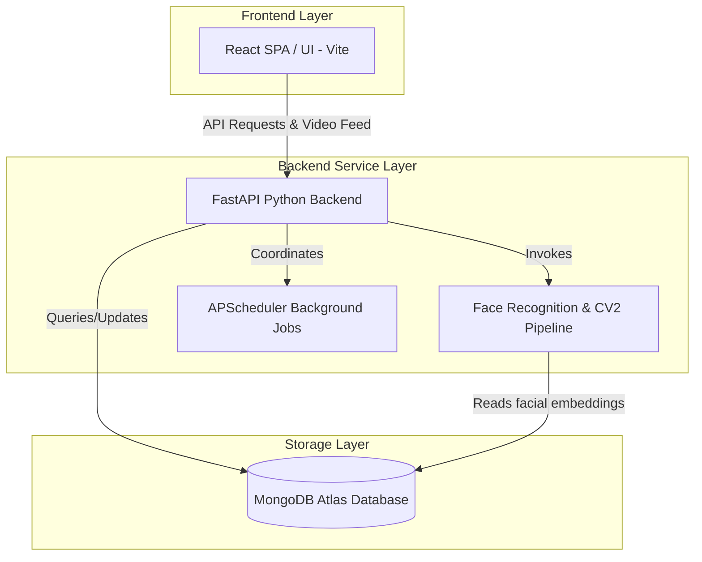

# 🔮 AI Face Recognition Employee Attendance & Monitoring System

[](https://fastapi.tiangolo.com/)
[](https://react.dev/)
[](https://vitejs.dev/)
[](https://www.mongodb.com/)
[](https://www.python.org/)

An advanced, premium-tier **Web-Based** employee attendance tracker powered by artificial intelligence. This system combines a modern, reactive React web application with a high-performance Python FastAPI service to offer state-of-the-art live facial recognition attendance tracking. 

---

## ✨ Working Features

### 1. 🧠 Live Face Recognition Pipeline
- **Real-Time Processing**: Utilizes ultra-fast biometric identification using convolutional neural network models (`face-recognition` & `dlib`) and OpenCV for live camera streaming directly from the web interface.
- **Liveness & Accuracy**: Extracts facial embeddings during registration and securely matches them against the live camera feed with high precision to mark attendance.

### 2. ⚡ Automated Attendance Management
- **Contactless Logging**: Employees simply walk up to the camera; the system detects the face, retrieves the corresponding employee profile, and automatically logs the entry/exit time.
- **Smart Validation**: The system calculates working hours, manages grace periods, and intelligently avoids duplicate check-ins within short time frames.

### 3. 🎨 Premium Admin Dashboard
- **Real-Time Analytics**: Visualizes attendance telemetry, daily trends, and department-wise statistics using beautifully animated `Recharts`.
- **Modern Interface**: A sleek, tailored CSS architecture supporting a dark-mode default interface, rich transitions, responsive layouts, and modern iconography (`Lucide React`).

### 4. 👥 Employee Management Portal
- **Centralized Database**: Add, edit, or remove employees and map them to their respective departments.
- **Secure Image Encoding**: Employee photos are instantly converted into 128-dimension mathematical arrays (embeddings) and stored securely in MongoDB, ensuring privacy and fast retrieval.

### 5. 🔒 Secure Authentication & Data
- **JWT Protection**: The admin dashboard and sensitive API endpoints are secured via JWT token authentication and bcrypt password hashing.
- **Cloud Database Integration**: Fully integrated with MongoDB Atlas for secure, cloud-based data storage ensuring zero data loss and accessibility from anywhere.

---

## 🏗️ System Architecture



---

## 🛠️ Tech Stack

### Frontend Application
- **React (v19)** with **Vite (v8)**
- **Recharts** for attendance telemetry and data visualization
- **Lucide React** for interactive, premium iconography
- Customized Vanilla CSS3 framework supporting HSL-tailored variables and glassmorphism

### Backend Service
- **Python (v3.10+)** with **FastAPI**
- **Dlib** & **Face Recognition** (biometrics and facial processing)
- **OpenCV (cv2)** (camera processing and frame extraction)
- **APScheduler** (cron tasks and telemetry aggregations)
- **PyJWT** & **passlib** (secure user credentials management)
- **Pydantic** (data validation and schema enforcement)

### Database
- **MongoDB Atlas** (Cloud Database Cluster)

---

## 💻 Developer Setup

Follow these steps to set up the project locally for development.

### Prerequisites
- **Node.js** (v18 or higher)
- **Python** (v3.10.x recommended)
- **C++ Build Tools** (Required on Windows for compiling `dlib`. Install via Visual Studio Build Tools).
- **MongoDB Atlas Account** (Create a free cluster at mongodb.com).

### 1. Database Configuration
1. Log in to MongoDB Atlas and create a new cluster.
2. Under **Database Access**, create a user and password.
3. Under **Network Access**, add your current IP address (or `0.0.0.0/0` for development).
4. Get your connection string (URI) to be used in the `.env` file.

### 2. Backend Setup
1. Open a terminal and navigate to the backend directory:
   ```bash
   cd backend
   ```
2. Create and activate a Python virtual environment:
   ```bash
   python -m venv venv
   # Windows:
   .\venv\Scripts\activate
   # macOS/Linux:
   source venv/bin/activate
   ```
3. Install the required Python dependencies:
   ```bash
   pip install -r requirements.txt
   ```
4. Create a `.env` file in the `backend` directory and add your configurations:
   ```env
   MONGO_URI=mongodb+srv://<username>:<password>@cluster.mongodb.net/?retryWrites=true&w=majority
   MONGO_DB=attendance_db
   SECRET_KEY=your_super_secret_jwt_key
   ```
5. Start the FastAPI development server:
   ```bash
   python run.py
   ```
   *The server will start at `http://127.0.0.1:8000` and automatically connect to MongoDB and seed default data.*

### 3. Frontend Setup
1. Open a new terminal and navigate to the frontend directory:
   ```bash
   cd frontend
   ```
2. Install the Node.js dependencies:
   ```bash
   npm install
   ```
3. Create a `.env` file in the `frontend` directory (if needed to override defaults):
   ```env
   VITE_API_URL=http://127.0.0.1:8000
   ```
4. Start the Vite development server:
   ```bash
   npm run dev
   ```
   *The application will be accessible at `http://localhost:5173`.*

---

## 📝 License
This project is licensed under the MIT License.

Developed with 💜 by the **Aravind22s / CADD Team**.
